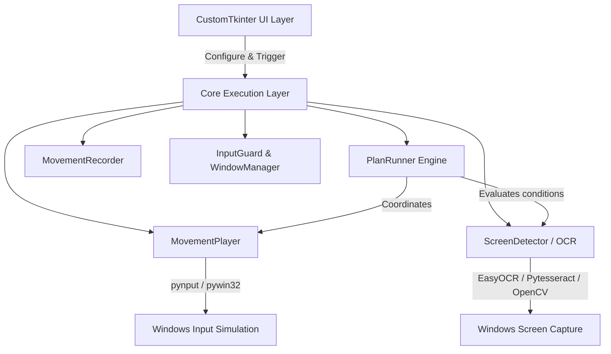

# Architecture & Design Decisions — PokemonAutoShiny

This document details the system architecture, component boundaries, concurrency model, and Architectural Decision Records (ADRs) for **PokemonAutoShiny**.

---

## 1. System Architecture Overview

PokemonAutoShiny is designed around a modular event-driven architecture that separates GUI presentation from background execution, input recording/playback, and computer-vision detection.

### Component Breakdown

| Subsystem | Key Modules | Responsibilities |
| :--- | :--- | :--- |
| **Execution Engine** | `core/plan_runner.py` `core/auto_runner.py` | State-machine executing node-based hunt plans, managing loop counts, branching, timeouts, and shiny abort events. |
| **Input & Playback** | `core/player.py` `core/recorder.py` `core/input_guard.py` | Captures and replays exact keyboard/mouse events with configurable jitter, delays, and safety fail-safes. |
| **Vision & Detection** | `core/detector.py` `core/first_run.py` | Multi-engine screen analysis: EasyOCR neural network, Tesseract fallback, OpenCV template matching, color/brightness shiny detection. |
| **Window & OS Layer** | `core/window_manager.py` `core/paths.py` | Window focus, DPI scaling handling, portable and frozen path resolution for PyInstaller. |
| **UI Presentation** | `ui/app.py` `ui/plan_graph.py` `ui/sequence_editor.py` `ui/condition_editor.py` | Node-graph canvas, sequence visualizer, transparent OCR region selector bubble, dark-themed CustomTkinter views. |

---

## 2. Concurrency & Threading Model

- **Main Thread (UI Mainloop):** Handles CustomTkinter rendering, user interactions, graph node manipulation, and real-time counter updates via thread-safe callbacks.
- **Worker Thread (`PlanRunner` / `MovementPlayer`):** Executes sequence steps and OCR checks in dedicated background threads to prevent freezing the UI.
- **Hook Listeners (`pynput`):** Global low-level keyboard listeners running on separate OS threads for instant emergency hotkey toggling (`F8`, `F9`).
- **Synchronization Primitives:** Uses `threading.Event` (`_abort_event`) for responsive, zero-CPU-polling thread cancellation and shiny detection interrupts.

---

## 3. Architecture Decision Records (ADRs)

### ADR-001: Use threading.Event for Concurrency Control

- **Status:** Accepted
- **Date:** 2026-07-26
- **Context:** `PlanRunner` operates in a background thread and needs instant responsiveness to user cancellation and shiny detection events. Previously, boolean flags (`_stop_flag`, `_shiny_flag`) with busy-wait loops (`time.sleep(0.05)`) wasted CPU cycles and added stop latency.
- **Decision:** Refactor `PlanRunner` to use standard Python `threading.Event()` (`_abort_event`) for synchronization.
- **Consequences:**
  - Zero-polling CPU overhead during idle wait periods.
  - Sub-millisecond responsiveness when stopping or when a shiny is detected.
  - Cleaner exception handling and thread safety.

---

### ADR-002: PlanRunner Node Logic Separation and Strong Typing for Match Modes

- **Status:** Accepted
- **Date:** 2026-07-26
- **Context:** The main `PlanRunner._run` loop exceeded 100 lines, mixing execution control for multiple node types (`start`, `condition`, `seq`). String match modes (`"contains"`, `"regex"`) were hardcoded magic strings prone to typos.
- **Decision:**
  1. Extract node processing logic into dedicated methods (`_process_condition_node`, `_process_seq_node`).
  2. Introduce a `MatchMode` Enum inheriting from `str` and `Enum` to enforce compile/lint-time type safety while remaining backward-compatible with JSON plan files.
- **Consequences:**
  - High-level state machine flow is clear and maintainable.
  - Type safety prevents runtime typos in condition evaluations.
  - Adding future node types is modular and isolated.

---

### ADR-003: Decouple PlanRunner from Component Internals

- **Status:** Accepted
- **Date:** 2026-07-26
- **Context:** Encapsulation leaks existed where `_text_matches` imported `ScreenDetector` locally to invoke private methods, and `PlanRunner` directly accessed `self.player._thread.join()`.
- **Decision:**
  1. Refactor `_text_matches` to accept an optional callable parameter `is_shiny_func`.
  2. Provide a public `wait_for_completion()` method on `MovementPlayer` and use this clean interface in `PlanRunner`.
- **Consequences:**
  - Eliminated hidden circular dependencies and private attribute access.
  - Clear architectural boundaries between playback, runner, and detector.

---

### ADR-004: Use Monotonic Time for Timeouts

- **Status:** Accepted
- **Date:** 2026-07-26
- **Context:** Timeouts were calculated using `time.time()`. System clock modifications or NTP sync adjustments could cause timeouts to trigger immediately or hang indefinitely.
- **Decision:** Switch from `time.time()` to `time.monotonic()` for all interval, timeout, and jitter calculations.
- **Consequences:**
  - Guarantees strict monotonic progression regardless of system clock changes.
  - Prevents race conditions and freeze bugs in long-running bot sessions.

---

### ADR-005: Node Handler Map for Extensibility and Explicit Exception Scoping

- **Status:** Accepted
- **Date:** 2026-07-26
- **Context:** Node execution used chained `if/else` checks, violating the Open/Closed Principle. Broad `except Exception` blocks caught syntax or type errors in config parsing, masking bugs.
- **Decision:**
  1. Use a dictionary dispatch map (`node_handlers`) binding node type strings directly to processing methods.
  2. Catch specific exceptions (`ValueError`, `TypeError`, `KeyError`) during parameter parsing with safe defaults before the general exception handler.
- **Consequences:**
  - Easy extension of custom node types without altering the core execution loop.
  - Clear error reporting separating configuration errors from OCR/Vision hardware failures.

---

## 4. Known Technical Constraints & Invariants

1. **Windows OpenMP & PyTorch Initialization:** Must set `os.environ["KMP_DUPLICATE_LIB_OK"] = "TRUE"` and resolve `torch/lib` DLL directory before importing OpenCV or GUI libraries to prevent Windows `WinError 1114`.
2. **PyInstaller Portable Path Resolution:** All user-writable data (`data/movements/`, `data/plans/`, `debug.log`) must resolve relative to `sys.executable` parent directory when frozen, not `_MEIPASS`.
3. **EasyOCR Model Weights:** Models are downloaded to `%USERPROFILE%\.EasyOCR\model\` on first launch to keep installer binaries lightweight (~240 MB instead of ~2 GB).
